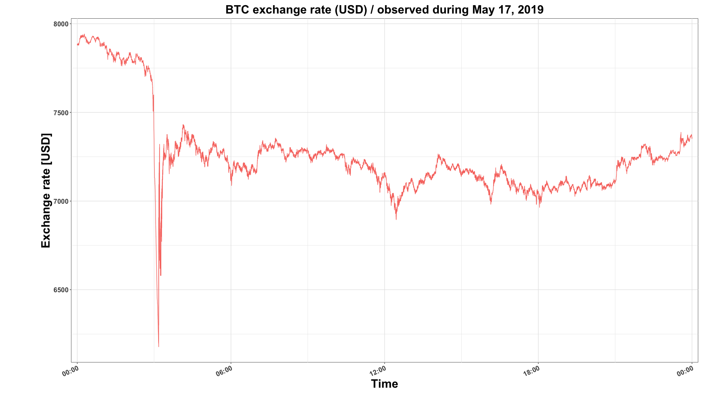

[](http://quantlet.de/)

## [](http://quantlet.de/) **Plot_jump_day** [](http://quantlet.de/)

```yaml

Name of QuantLet : Plot_jump_day

Published in : 'To be published in METIS'

Description : 'Plots the time series of a trading day on Bitstamp & BTC/USD exchange rate'

Keywords : Jumps, jump test, high frequency, time series, Ait-Sahalia, Jacod, Lee, Mykland, stochastic processes, cryptocurrencies, crypto, spectogram

See also : 'Lee, S.S. and Mykland, P.A. (2012) Jumps in Equilibrium Prices and Market Microstructure Noise; Ait-Sahalia, Y. and Jacod, J. (2012) Analyzing the Spectrum of Asset Returns: Jump and Volatility Components in High Frequency Data'

Author : Danial Florian Saef

Submitted : January 29 2020 by Danial Saef
```



### R Code
```r

## install and load packages ##
libraries = c("data.table", "ggplot2", "scales")
lapply(libraries, function(x) if (!(x %in% installed.packages())) {install.packages(x)} )
## ##

## settings ##
Sys.setenv(LANG = "en") # set environment language to English
Sys.setlocale("LC_TIME", "en_US.UTF-8") # set timestamp language to English
## ##

## read data ##
DT_subs <- fread("bitstamp_may17_btcusd.csv")
## ##

##
plot_theme <- theme(panel.border = element_blank(), panel.background = element_blank(),
                  axis.text = element_text(size = 14, face = "bold"),
                  axis.title = element_text(size = 24, face = "bold"),
                  strip.text = element_text(size = 14, face = "bold"),
                  plot.title = element_text(size = 24, face = "bold", hjust = .5)
)
##

### plot it ###
ggplot(data = DT_subs, mapping = aes(y = p, x = t, group = Symbol, colour = Symbol)) +
  geom_line(size = 2, col = "steelblue") +
  plot_theme +
  labs(x = "Time", y = "Exchange rate [USD]" ,
       title = paste("BTC exchange rate (USD) / observed during",
                     as.character(lubridate::month(head(DT_subs$date, 1), label = TRUE, abbr = FALSE)),
                     paste(mday(head(DT_subs$date, 1)),  ",", sep = ""),
                     year(head(DT_subs$date, 1))
       )) +
  scale_x_datetime(limits = c(min = min(DT_subs$t), max = max(DT_subs$t)), expand=c(0.01,0.01),  labels = date_format("%H:%M")) +
  theme(legend.position = "none",
        panel.background = element_rect(fill = "transparent"), # bg of the panel
        plot.background = element_rect(fill = "transparent", color = NA), # bg of the plot
        panel.grid.major = element_blank(), # get rid of major grid
        panel.grid.minor = element_blank(), # get rid of minor grid
        legend.background = element_rect(fill = "transparent"), # get rid of legend bg
        legend.box.background = element_rect(fill = "transparent"), # get rid of legend panel bg
        plot.margin = margin(10, 10, 10, 85)
  )

```

automatically created on 2020-01-29